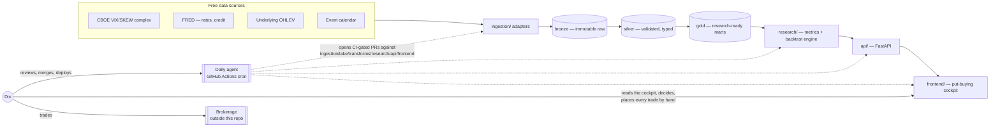
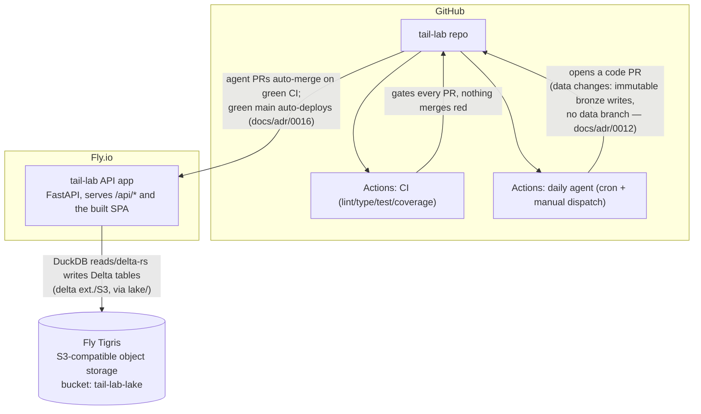
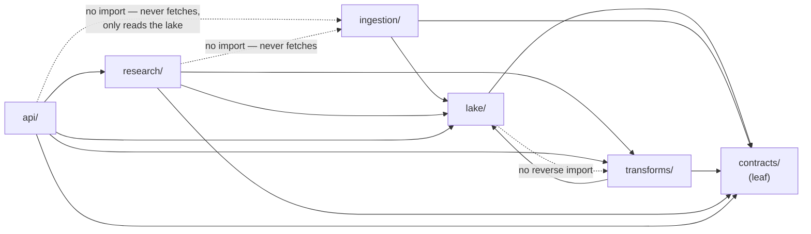

# Architecture

The folder layout of this app, its medallion lakehouse, and the module
dependency rule the agent's PRs are checked against. **Do not deviate**
without updating this file (and, if the decision is significant, an ADR) in
the same change. `README.md` is the canonical specification this file
implements; if the two ever disagree, `README.md` wins and this file is
stale.

## Top-level

```
tail-lab/
├── src/tail_lab/            # Python — all backend code, one package (see below)
├── frontend/                # React + Vite + TS dashboard
├── tests/                   # pytest, mirrors src/tail_lab/ layout module-for-module
├── docs/                    # END_STATE, AGENT_MISSION, STANDARDS, DATA_CONTRACTS, adr/
├── .github/workflows/       # CI (lint/type/test/coverage/import-linter) + the daily agent cron
├── AGENT_TODO.md            # The agent's backlog (it owns this file)
├── HUMAN_TODO.md            # Dio's backlog — accounts, keys, money, deploys
├── ARCHITECTURE.md          # This file
└── README.md                # Canonical specification — read this first
```

### System context

*What talks to what, and where the human/agent sit relative to the system.*



The agent never touches the `BROKER` node or anything between `DASH` and
`HUMAN`'s trading decision — see `docs/adr/0007` and `docs/AGENT_MISSION.md`.

### Deployment



## Backend — `src/tail_lab/`

One Python package. Each subpackage is a layer with a single purpose; the
dependency direction between layers (below) is machine-checked, not just
documented.

```
src/tail_lab/
├── contracts/               # Leaf layer. pandera/pydantic schemas + shared
│   │                        # DTOs. Imports nothing else in tail_lab.
│   ├── datasets.py          # One pandera schema per core dataset (OhlcvRow,
│   │                        # VolComplexRow, RatesRow, CreditRow, EventRow,
│   │                        # OptionChainRow) — see docs/DATA_CONTRACTS.md.
│   ├── events.py            # EventRecord (scheduled + manual calendar).
│   └── metrics.py           # SensitivityMetricResult, BacktestResult,
│                             # CandidateResult — DTOs shared by research
│                             # and api so the two never drift.
│
├── ingestion/                # One adapter module per external source.
│   │                         # Each adapter: fetch() -> raw frame, validates
│   │                         # against a contracts/ schema, writes bronze via
│   │                         # lake/. Adapters never read silver/gold.
│   ├── base.py               # Adapter protocol: fetch(), source_id, cadence,
│   │                         # keyless: bool.
│   ├── vix_complex.py        # CBOE VIX/VIX3M/VIX9D/VVIX/SKEW (keyless).
│   ├── fred_rates.py         # Treasury curve/SOFR/fed funds (needs FRED key
│   │                         # → HUMAN_TODO.md until the key exists).
│   ├── fred_credit.py        # HY/IG OAS (FRED, same key).
│   ├── underlying_ohlcv.py   # Broad-universe daily OHLCV.
│   ├── event_calendar.py     # Scheduled events (FOMC/CPI/earnings) +
│   │                         # manual unscheduled table.
│   └── option_chains.py      # Forward-collected chains, narrow tradable set.
│
├── lake/                     # DuckDB + Delta Lake (delta-rs) + object-storage
│   │                         # glue. The ONLY place that talks to object
│   │                         # storage (docs/adr/0012, docs/adr/0013).
│   ├── store.py              # LakeStore (the abstract interface) +
│   │                         # DeltaLakeStore — the ONE implementation
│   │                         # (as-of resolution, immutable-bronze,
│   │                         # medallion path scheme, content-hash snapshot
│   │                         # id), rooted at either a local directory
│   │                         # (default) or s3://tail-lab-lake on Fly
│   │                         # Tigris, selected via TAIL_LAB_LAKE_BACKEND
│   │                         # (tail_lab.config.get_lake_store).
│   └── asof.py               # THE as-of query primitive. Every backtest
│                              # read goes through this module — see
│                              # docs/STANDARDS.md and docs/adr/0009.
│
├── transforms/                # bronze → silver validation gate;
│   │                          # silver → gold mart builders.
│   ├── validate.py            # Contract-driven validate-or-quarantine
│   │                          # (docs/STANDARDS.md §Data contracts).
│   └── marts/
│       ├── sensitivity_leaderboard.py   # Gold mart: per-metric rankings.
│       ├── candidate_puts.py            # Gold mart: OOM-put candidates.
│       └── regime_panel.py              # Gold mart: regime classification.
│
├── research/                  # Where "which metric backtests best" gets
│   │                          # answered. The correctness-critical layer.
│   ├── metrics/                # One module per sensitivity metric.
│   │   ├── downside_beta.py
│   │   ├── co_skewness.py
│   │   └── ...
│   ├── pricing/                 # Pluggable option-pricing interface.
│   │   ├── interface.py         # OptionPricer protocol.
│   │   ├── black_scholes.py     # v1 implementation: BS + vol-surface proxy.
│   │   └── real_quotes.py       # Future: real historical quotes (docs/adr/0004).
│   └── backtest/
│       ├── engine.py            # Simulation clock; reads ONLY via lake/asof.py.
│       └── compare.py           # Cross-metric backtest comparison.
│
└── api/                       # FastAPI app. The ONLY layer the frontend talks to.
    ├── main.py                 # Composition root: middleware, router includes.
    ├── deps.py                  # Shared FastAPI dependencies (DuckDB session, etc.).
    └── routes/
        ├── leaderboard.py       # Sensitivity leaderboard endpoint(s).
        ├── candidates.py        # OOM-put candidates endpoint(s).
        ├── regimes.py           # Regime panel.
        ├── events.py            # Event calendar + proximity flags.
        └── backtests.py         # Backtest comparison endpoints.
```

### Module dependency direction — hard, machine-checked rule



Rules, precisely. **Distinguish two different arrows:**

- **Data *flows* `sources → ingestion → lake (bronze) → transforms (silver/gold) → research → api → dashboard`.** That is the pipeline order — how bytes move.
- **Import *dependencies* point the other way — downward, toward the foundation.** The layer stack, highest to lowest, is `api > research > (ingestion, transforms) > lake > contracts`. A layer may import the layers **below** it; never one above. `ingestion` and `transforms` are **peers** (neither imports the other). Concretely: `lake` imports only `contracts`; an ingestion adapter imports `lake` (to persist what it fetched) and `contracts`; `research`/`api` sit on top. Skip-level imports downward are fine (e.g. `api` reading `lake` for a pass-through endpoint).

- **`contracts/` imports nothing else in `tail_lab`.** It is the leaf every other layer depends on.
- **`lake/` is the foundation above `contracts/`.** It imports nothing internal except `contracts/`. It must never import `ingestion`, `transforms`, `research`, or `api` — the storage layer knows nothing about who fills it or reads it.
- **Two deliberate carve-outs: neither `api` nor `research` may import `ingestion`.** Fetching from external sources is a write-path concern triggered by the ingestion schedule or the agent, never by an HTTP request and never by a metric/backtest. The read/serve side depends only on data already in the lake. If an endpoint or a metric seems to need `ingestion`, that data belongs in a gold mart instead.
- **No reverse imports, ever.** Enforced by `import-linter` in CI (a `layers` contract for the stack + a `forbidden` contract for the two ingestion carve-outs — see `pyproject.toml`). A violation fails the build; it is not a style suggestion.
- **`frontend/` talks to `api/` over HTTP only.** No frontend code imports
  Python, and no backend code imports `frontend/`.

### Where new code goes

| New thing | Goes in |
|---|---|
| New data source | `ingestion/<source>.py` (adapter) + a schema in `contracts/datasets.py`. If the source needs an API key or account, add the setup step to `HUMAN_TODO.md`, not code that assumes it exists. |
| New sensitivity metric | `research/metrics/<metric>.py`, registered with the backtest comparison; a test pinning a synthetic case with a known answer (`docs/STANDARDS.md`). |
| New gold mart | `transforms/marts/<mart>.py` + a DTO in `contracts/metrics.py` (or `datasets.py`) describing its output shape. |
| New dashboard tile | A component under `frontend/src/components/` + the `api/routes/*.py` endpoint it reads, with the response type mirrored by hand into `frontend/src/types.ts`. |
| New option-pricing implementation | `research/pricing/<name>.py` implementing the `OptionPricer` protocol in `research/pricing/interface.py`. Never change the interface's shape without an ADR (`docs/adr/0004`). |
| New backtest strategy/screen | `research/backtest/` — must read exclusively through `lake/asof.py`; a test that tries to leak future data must fail (`docs/adr/0009`). |
| New API endpoint | A module in `api/routes/`, mounted in `api/main.py`. Thin: validate, call into `research`/`transforms`/`lake`, return a `contracts/` DTO. |
| New env var / secret | Declared once, in the backend's settings module (mirrors `paper_app`'s `Settings` pattern). Never read `os.environ` elsewhere. If it's a credential, it's a `HUMAN_TODO.md` item, not something the agent provisions. |
| New shared cross-layer type | `contracts/` — never duplicate a shape between `research` and `api`. |

## Frontend — `frontend/`

React + TypeScript (strict), talking to `api/` over HTTP only — mirrors the
`paper_app` pattern of a single typed HTTP client (`src/api.ts`) plus a
hand-mirrored `src/types.ts`. Layout details (pages/components/hooks split)
follow the same shape as `paper_app/frontend`; the cockpit's tiles
(leaderboard, candidates, regime panel, event calendar, backtest
comparison, conventional-strategy tab) each get their own component under
`components/<feature>/` per the "where new code goes" table above.

## The medallion lakehouse

- **Bronze — immutable raw.** Exactly what an adapter fetched, one Delta
  table per dataset, **partitioned by `ingest_date`**. **Never overwritten,
  never edited in place** — a re-fetch or a correction is a new
  `ingest_date` partition (a new Delta commit), never a mutation; re-ingesting
  an `ingest_date` that already has a partition is a no-op. This is what
  makes point-in-time reads possible at all.
- **Silver — validated, typed.** Bronze rows pass through the
  `contracts/` schema; rows that fail are quarantined (written aside with
  the validation error attached), never silently dropped and never allowed
  to pollute silver. Silver is what `research/backtest` treats as "the
  data as it was known."
- **Gold — research-ready marts.** Derived, denormalized views built by
  `transforms/marts/` for a specific consumer: the sensitivity leaderboard,
  the OOM-put candidate list, the regime panel. `api/` reads gold (or, for
  simple cases, silver) — never bronze.
- **Engine:** DuckDB, embedded, reading Delta tables directly on object
  storage via its `delta` extension (`delta_scan()`) — no separate database
  server to run or deploy, and no versioning service between the app and
  the bucket.
- **Storage format/versioning:** Delta Lake tables (delta-rs — no Spark, no
  JVM) on Fly Tigris (S3-compatible object storage, bucket `tail-lab-lake`)
  — no lakeFS, no git-style data branching. Point-in-time correctness and
  bronze immutability are implemented once, in application code
  (`DeltaLakeStore`, the same class rooted at either a local directory or
  the Tigris bucket), on top of Delta's ACID commits and native time
  travel; every result cites a content-hash **snapshot id** instead of a
  lakeFS commit or a raw Delta version. See `docs/adr/0005`, `docs/adr/0006`,
  `docs/adr/0012`, `docs/adr/0013`.

## Hard rules — do not deviate

These are the constitution from `README.md`, restated here as the rules
structural changes are checked against. Changing any requires a
human-approved ADR — the agent may propose one, never enact it
(`docs/AGENT_MISSION.md`).

1. **No look-ahead / point-in-time correctness is the #1 invariant.** A
   backtest reads data only as of its simulation clock, via
   `lake/asof.py`. Tests that try to cheat (read tomorrow's data today)
   must fail. (`docs/adr/0009`)
2. **Bronze is never overwritten.** Raw ingested data is immutable — a
   correction is a new bronze snapshot, never an edit in place
   (`docs/adr/0012`).
3. **The agent never trades and never touches money or credentials.** It
   improves the platform only. There is a permanent wall between
   research/tooling and execution. (`docs/adr/0007`)
4. **Reproducibility.** Every result carries the bronze snapshot id
   (`docs/adr/0012`) + code SHA that produced it and can be re-run
   bit-for-bit.
5. **Two backlogs, kept separate.** The agent manages `AGENT_TODO.md`.
   Anything needing an account, API key, or money goes to `HUMAN_TODO.md`
   and is never attempted by the agent. (`docs/adr/0002`)
6. **Free-data first.** The platform is built on free, ideally keyless,
   sources. Paid/account-gated upgrades are opt-in human decisions.
   (`docs/adr/0002`)
7. **Module dependency direction is machine-checked**, not just documented
   — see the diagram and `import-linter` rule above.
8. **Every change is a PR gated by CI.** Ordinary agent increments
   (`agent/*` branches) auto-merge once every CI gate is green, and green
   `main` auto-deploys to Fly via the CD workflow (`docs/adr/0016`);
   constitution changes are blocked from auto-merge by CI's
   constitution-guard and require a human-reviewed PR. The agent never
   runs a deploy itself and never holds credentials; every automated
   action leaves a detailed audit record (`docs/STANDARDS.md` §f). The
   agent may propose nothing on a given day.

## See also

- `README.md` — the canonical specification.
- `docs/END_STATE.md` — the detailed end-state this architecture builds toward.
- `docs/STANDARDS.md` — how these rules are enforced (tests, typing, CI, coverage).
- `docs/DATA_CONTRACTS.md` — the six core dataset schemas.
- `docs/adr/` — the decisions behind each rule above.
