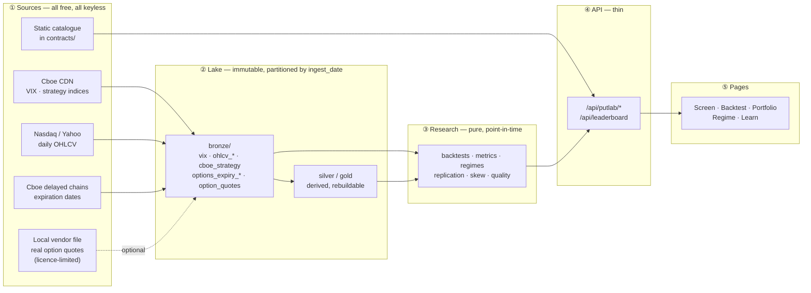
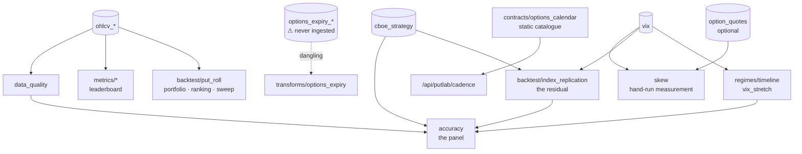

# Data flow — where every number on the screen comes from

**What this file is.** A lineage map: for each page of the app, which data
sources feed it, how the data gets from a vendor's file to a pixel, and what
breaks when a source dies.

**What it is not.** `ARCHITECTURE.md` owns *structure* — the layer rule, the
deployment topology, where new code goes — and is not repeated here. Read that
one to know where code lives; read this one to know where a **number** came
from. `docs/DATA_CONTRACTS.md` owns each dataset's schema;
`docs/DATA_FINDINGS.md` owns which sources currently work.

Two audiences, and they want different things, so the file is layered: §1 is
the one-screen map, §2–§3 are the per-page and per-source registers a person
debugging a wrong number needs, and §4 is the impact analysis to run *before*
changing a source.

---

## 1. The one-screen map

Free vendor → immutable bronze → a pure research function → a thin route → a
component. Five hops, no exceptions, and the arrows only ever point right.

**The one rule that makes the map trustworthy.** Every read into the lake goes
through `LakeStore.read_bronze_as_of(dataset, as_of)`, which returns the latest
snapshot ingested **on or before** `as_of` and never merges partitions
(`docs/adr/0009`, `docs/adr/0013`). So any number on any page can be traced to
exactly one bronze partition, and re-running with the same `as_of` reproduces
it. The corollary is the trap: a **new partition shadows the old one**, so
re-ingesting a symbol from a different vendor silently changes every downstream
number (`docs/DISCOVERIES.md` #2).

---

## 2. What feeds each page

The app is one workspace with five tabs, plus a home dashboard. Each row lists
what the tab answers, the endpoints it calls, and the bronze datasets those
endpoints ultimately read.

| Page / tab | The question it answers | Endpoints | Datasets read |
|---|---|---|---|
| **Fragility ranking** (pinned above every tab) | Which names are most fragile versus the market? | `/api/putlab/leaderboard` | `ohlcv_*` (whole screening universe + `ohlcv_spy` as benchmark) |
| **Screen** | Which screen actually picks winners? | `/api/putlab/metric-screen` | `ohlcv_*` |
| **Backtest** | What would this hedge have done? | `/api/putlab/backtest`, `/sweep`, `/cadence`, `/regime-verdict`, **`/accuracy`** | `ohlcv_<asset>`, `ohlcv_spy` (hurdle), `vix`, `cboe_strategy` |
| **Portfolio** | What does a blend of legs do? | `/api/putlab/portfolio`, `/api/putlab/leaderboard` | `ohlcv_*` |
| **Regime** | What market are we in? | `/api/putlab/regimes`, `/api/vix/stretch` | `vix` |
| **Learn** | — (static explanation) | none | none |
| **Home dashboard** | Headline VIX stretch + sensitivity leaderboard | `/api/vix/stretch`, `/api/leaderboard` | `vix`, `ohlcv_*` |

**The accuracy panel is the densest node in the graph.** It renders under every
backtest result and, alone in the app, reads *four* datasets at once — the
replication residual (`cboe_strategy` + `vix`), the benchmark comparison
(`cboe_strategy`), the regime mix (`vix`), and the input scan
(`ohlcv_<asset>`). It is also the only endpoint that **must not 404**: each
block degrades independently, because a blank accuracy panel reads as "no
concerns" (README, *Accuracy is surfaced, not filed*).

Two things on this map are **not** in the lake at all:

- **The screening universe and the options-cadence labels**
  (`/api/putlab/universe`, `/api/putlab/cadence`) come from a static catalogue
  in `contracts/options_calendar.py`. No freshness, no failure mode — and see
  the dangling branch below, because this is *not* what the architecture
  intended.
- **Feedback and hypothesis memory** are JSON blobs under `ops/` via
  `BlobStore`, not Delta tables — different lifecycle, never point-in-time
  read (`docs/adr/0014`, `docs/adr/0015`).

---

## 3. Source register

Every source, what it produces, and how it is fetched. "Keyless" means no
account, no API key, no money — the constitution's free-data-first rule.

| Source | Produces | Cadence | Keyless | Fallback | Fetched by |
|---|---|---|---|---|---|
| **Cboe CDN** — `VIX_History.csv` | `vix` (1990→) | daily | ✅ | Yahoo | `make ingest-vix` |
| **Cboe CDN** — `{TICKER}_History.csv` | `cboe_strategy` (11 indices, 1975→) | daily | ✅ | none | `make ingest-cboe-strategy` |
| **Nasdaq** historical | `ohlcv_<symbol>` | daily | ✅ | Yahoo | `make ingest-ohlcv SYMBOL=…` |
| **Cboe** delayed quote chain | `options_expiry_<symbol>` | daily | ✅ | Yahoo (cookie+crumb) | ⚠️ **nothing** — see §3.1 |
| **Local vendor file** — lambdaclass `data-v1` | `option_quotes` (42,131 real SPY quotes, 2008→2025) | one-shot | ✅ (manual download) | none | `make ingest-option-quotes` |
| **Static catalogue** | screening universe, options cadence | n/a | ✅ | n/a | none — it is code |

### 3.1 One dangling branch — `options_expiry`

Writing this map surfaced a gap worth recording rather than quietly fixing.
`ingestion/options_expiry.py` and `transforms/options_expiry.py` both exist,
are tested, and have a fallback chain. But:

- there is **no `make ingest-options-expiry` target**, so nothing ever runs it;
- **no `options_expiry_*` partition exists in production bronze** (verified
  2026-08-22);
- `/api/putlab/cadence` answers from the **static catalogue**, not from the
  lake, so the panel works and nobody noticed.

So the code path is real, the data path is not. That is the most dangerous
shape a pipeline can have — it looks wired on a dependency graph and is inert
in production — and a lineage map is exactly the artifact that should catch
it. Queued in `AGENT_TODO.md`; nothing is broken today because the static
catalogue is honest about being static.

**Sources do not depend on each other.** Every arrow in §1 runs source →
lake; there is no source that must be fetched before another. What *is*
coupled is downstream: several research functions need **two or three
datasets to line up on the same dates**, and that is where breakage actually
appears.

**Read the fan-in, not the fan-out.** `ohlcv_*` feeds the most consumers, but
`accuracy` is the node that fails in the most ways — it depends on three
datasets and two research modules, which is exactly why it was built to
degrade block by block instead of raising.

---

## 4. Impact analysis — what breaks if a source dies

Run this table *before* changing or re-ingesting a source, not after. Every
free source here has already degraded at least once: Yahoo went from "works" to
"429s everywhere" in two days and nothing noticed until a human looked
(`docs/DATA_FINDINGS.md`).

| If this dies | Breaks immediately | Still works | Detected by |
|---|---|---|---|
| **Cboe VIX** | Regime tab, VIX stretch tile, the residual, the regime mix in the accuracy panel | every backtest, the ranking, the screen | nothing yet — canary is queued |
| **Cboe strategy indices** | the residual, the benchmark table in the accuracy panel | everything else; the panel drops two blocks and says so | nothing yet |
| **OHLCV (Nasdaq + Yahoo both)** | **everything** — no price path, no backtest, no ranking | the Regime tab | the backtest 404s loudly |
| **Cboe chains + Yahoo** | **nothing** — the dataset is never ingested (§3.1) | everything, including the cadence panel | n/a |
| **`option_quotes`** (licence-limited) | `make skew` only | **everything** — by construction | raises `LookupError` |

**The asymmetry is deliberate.** The licence-limited source is the one whose
death costs least, because nothing in `research/` or `api/` is allowed to
require it (`docs/DATA_CONTRACTS.md` #8). The source whose death costs most —
OHLCV — is the one with a fallback chain and the loudest failure.

**Silent failures are the ones to fear.** A source that 200s with an empty body
would commit an empty partition that then shadows good data
(`docs/DISCOVERIES.md` #3), which is why `ingestion/sources.py` treats an empty
result as a failed source and an exhausted chain raises rather than returning
empty. A **freshness canary** across all keyless sources is still open in
`AGENT_TODO.md`, and until it lands, the honest state of this column is "a
human notices".

---

## 5. Tracing one number end to end

The worked example, because a map is only useful if you can follow it once.
Take the headline on the Backtest tab: *"these returns are likely overstated by
~1.48%/yr."*

1. **Page** — `AccuracyPanel.tsx` renders it from `model.expected_optimism`.
2. **Fetch** — `fetchAccuracy()` → `GET /api/putlab/accuracy?asset=spy&…`.
3. **Route** — `putlab_accuracy` resolves `as_of` (defaults to today), serves
   from a 120 s memo or calls into research. The expensive input — replaying
   438 monthly PPUT rolls — is memoized separately for 15 minutes, because it
   depends only on `as_of` and is shared by every asset and parameter set.
4. **Research** — `compute_accuracy_report` picks the reference program nearer
   this run's strike and tenor, then blends that program's **per-regime**
   residual by the regime mix of this window.
5. **Lake** — three point-in-time reads: `cboe_strategy` (PPUT and SPX levels),
   `vix` (both the pricing input and the regime labels), `ohlcv_spy` (the
   quality scan).
6. **Source** — Cboe's CDN for the first two, Nasdaq for the third.

Every hop is reproducible from `as_of` alone. If the number looks wrong, the
fastest check is step 5: `make residual` prints the same replication the panel
is quoting.

---

## See also

- `ARCHITECTURE.md` — structure, layering, deployment (not repeated here)
- `docs/DATA_CONTRACTS.md` — per-dataset schemas and partition keys
- `docs/DATA_FINDINGS.md` — which sources currently work, with probe dates
- `docs/DATA_VERDICTS.md` — column-level trust for refereed datasets
- `docs/MODEL_RESIDUAL.md` — what the model-vs-market gap is, and why
- `docs/DISCOVERIES.md` — the failure modes this map is shaped around
